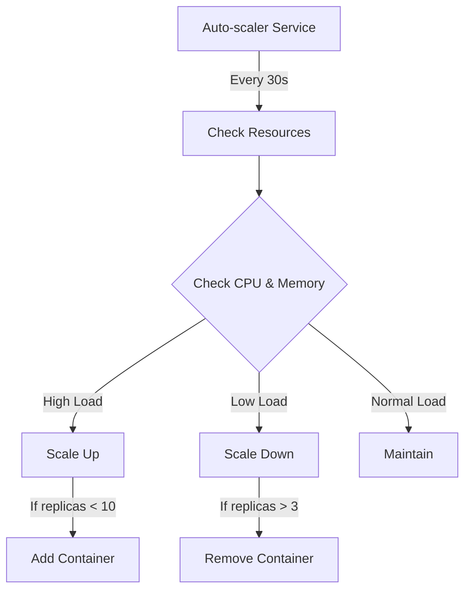
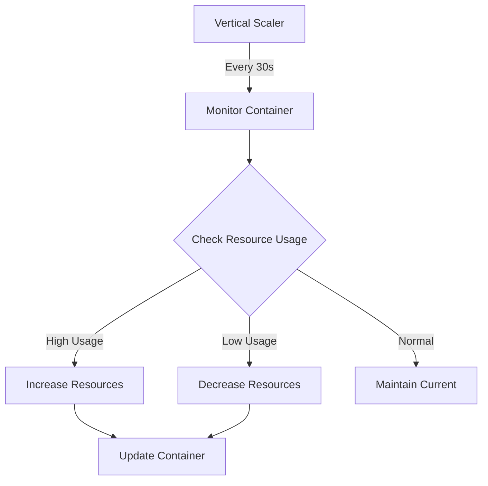

# Scalable Node.js Application with Docker

## 🔄 Auto-Scaling Implementation Overview

This project demonstrates both horizontal and vertical scaling in Docker Compose using resource-based metrics.

### 1. Horizontal Scaling (Scale Out/In)

This project demonstrates automatic scaling in Docker Compose using resource-based metrics. The implementation includes a custom auto-scaler service that monitors container resources and adjusts the number of application instances accordingly.

### How Auto-Scaling Works



#### 📊 Scaling Metrics and Thresholds

**Scale UP Conditions (OR):**
- CPU Usage > 70%
- Memory Usage > 80%
```bash
# Example Scale Up Scenario
Current Metrics:
CPU: 75%, Memory: 65%, Replicas: 4
Action: Scale to 5 replicas (CPU > 70%)
```

**Scale DOWN Conditions (AND):**
- CPU Usage < 30%
- Memory Usage < 40%
```bash
# Example Scale Down Scenario
Current Metrics:
CPU: 25%, Memory: 35%, Replicas: 6
Action: Scale to 5 replicas (Both CPU < 30% AND Memory < 40%)
```

#### 🔒 Scaling Limits
- Minimum Replicas: 3 (ensures high availability)
- Maximum Replicas: 10 (prevents resource exhaustion)
- Scale Step: 1 container at a time (prevents sudden resource spikes)

#### ⚙️ Resource Allocation Per Container
```yaml
resources:
  limits:
    cpus: '0.5'    # Maximum CPU usage
    memory: 256M   # Maximum memory usage
  reservations:
    cpus: '0.25'   # Guaranteed CPU
    memory: 128M   # Guaranteed memory
```

#### 🔍 Auto-Scaler Logic

1. **Monitoring Cycle:**
   ```bash
   while true; do
     # Check current state
     CURRENT_REPLICAS=$(docker compose ps -q app | wc -l)
     
     # Calculate averages across all containers
     CPU_USAGE=$(docker stats --no-stream ...)
     MEM_USAGE=$(docker stats --no-stream ...)
     
     # Apply scaling rules
     if [CPU > 70% || MEM > 80%] then
       scale_up()
     elif [CPU < 30% && MEM < 40%] then
       scale_down()
     fi
     
     # Wait for next check
     sleep 30
   done
   ```

2. **Health Checks:**
   ```yaml
   healthcheck:
     test: ["CMD", "curl", "-f", "http://localhost:3000/health"]
     interval: 30s
     timeout: 10s
     retries: 3
   ```

#### 📈 Example Scaling Scenarios

1. **High Load Scenario:**
   ```
   Time 0:   4 replicas, CPU: 65%, Memory: 75%
   Time 30s: 4 replicas, CPU: 85%, Memory: 77% → Scale UP
   Time 60s: 5 replicas, CPU: 70%, Memory: 65%
   ```

2. **Low Load Scenario:**
   ```
   Time 0:   5 replicas, CPU: 35%, Memory: 45%
   Time 30s: 5 replicas, CPU: 25%, Memory: 35% → Scale DOWN
   Time 60s: 4 replicas, CPU: 28%, Memory: 38%
   ```

#### 🛠️ Manual Scaling Commands
```bash
# Scale to specific number
docker compose up -d --scale app=6

# View current scale
docker compose ps

# Monitor scaling metrics
docker compose logs -f autoscaler
```

### 2. Vertical Scaling (Scale Up/Down)

The project includes a vertical scaling script that dynamically adjusts CPU and memory resources for individual containers based on their usage.



#### 📊 Vertical Scaling Thresholds

**Scale UP Conditions:**
```bash
# CPU Scaling Up
if CPU_Usage > 80% then
    increase CPU by 0.25 cores
    max limit: 2.0 cores

# Memory Scaling Up
if Memory_Usage > 80% then
    increase Memory by 128MB
    max limit: 1024MB
```

**Scale DOWN Conditions:**
```bash
# CPU Scaling Down
if CPU_Usage < 30% then
    decrease CPU by 0.25 cores
    min limit: 0.25 cores

# Memory Scaling Down
if Memory_Usage < 30% then
    decrease Memory by 128MB
    min limit: 128MB
```

#### 🔧 Resource Adjustment Steps
- CPU: 0.25 core increments
- Memory: 128MB increments
- Check Interval: 30 seconds

#### 📈 Example Vertical Scaling Scenario

```bash
Time 0:   Container1 [CPU: 0.5 cores, MEM: 256MB]
          Usage: CPU 85%, Memory 82%
          
Time 30s: Container1 [CPU: 0.75 cores, MEM: 384MB]
          Usage: CPU 65%, Memory 60%
          
Time 60s: Container1 [CPU: 0.75 cores, MEM: 384MB]
          Usage: CPU 45%, Memory 55%
```

#### 🛠️ Using the Vertical Scaler

1. **Make the script executable:**
   ```bash
   chmod +x vertical-scaler.sh
   ```

2. **Run the vertical scaler:**
   ```bash
   ./vertical-scaler.sh
   ```

3. **Monitor scaling actions:**
   ```bash
   # View real-time resource adjustments
   tail -f vertical-scaler.log
   ```

#### ⚙️ Configuration Options

The vertical scaler can be configured by adjusting these variables in the script:
```bash
MIN_CPU=0.25        # Minimum CPU cores
MAX_CPU=2.0         # Maximum CPU cores
MIN_MEMORY=128      # Minimum memory in MB
MAX_MEMORY=1024     # Maximum memory in MB
CPU_STEP=0.25       # CPU increment/decrement step
MEMORY_STEP=128     # Memory increment/decrement step in MB
CHECK_INTERVAL=30   # Check interval in seconds
```

#### 🔍 Vertical Scaling Benefits
- Fine-grained resource control
- No application disruption
- Efficient resource utilization
- Cost optimization
- Better performance under varying loads

#### ⚠️ Limitations
- Maximum resources limited by host capacity
- Some applications may need restart for resource changes
- Not all container types support dynamic resource updates

---

## Project Structure

```
.
├── app.js              # Main Node.js application
├── package.json        # Node.js dependencies
├── Dockerfile         # Docker image configuration
├── docker-compose.yml # Docker Compose configuration
├── nginx.conf         # Nginx load balancer configuration
└── test.hs           # Load testing script
```

## Prerequisites

- Docker and Docker Compose installed
- Node.js (for local development)
- Stack (Haskell) for running the load test

## Getting Started

1. **Clone the repository**
   ```bash
   git clone <repository-url>
   cd scale-node-js-docker
   ```

2. **Install dependencies (for local development)**
   ```bash
   npm install
   ```

3. **Run locally (optional)**
   ```bash
   npm start
   ```
   The application will be available at http://localhost:3000/health

## Running with Docker Compose

1. **Build and start the containers**
   ```bash
   docker compose up --build -d
   ```
   This will:
   - Build the Node.js application image
   - Start 6 replicas of the application
   - Start Nginx load balancer
   - The service will be available at http://localhost:8080/health

2. **View running containers**
   ```bash
   docker compose ps
   ```

3. **View container logs**
   ```bash
   docker compose logs -f
   ```

## Monitoring

1. **View Docker stats**
   ```bash
   docker stats
   ```
   This will show real-time CPU, memory, and network usage for all containers.

2. **View Nginx access logs**
   ```bash
   docker compose logs nginx
   ```

## Load Testing

The project includes a shell script that performs load testing by sending 5000 requests to the application.

1. **Make the script executable**
   ```bash
   chmod +x test.sh
   ```

2. **Run the load test**
   ```bash
   ./test.sh
   ```
   The script will:
   - Send 5000 requests to the health endpoint
   - Show progress in real-time
   - Display statistics including:
     - Total execution time
     - Average response time
     - Minimum and maximum response times

## Scaling

You can manually scale the number of application instances:

```bash
docker compose up --scale app=10 -d
```

## Shutdown

To stop all containers:
```bash
docker compose down
```

## Configuration

### Application (app.js)
- Default port: 3000
- Health endpoint: `/health`
- Returns: Instance ID, timestamp, and status

### Nginx (nginx.conf)
- Load balancing algorithm: Least Connections
- Listen port: 80 (mapped to 8080)
- Includes proper headers forwarding

### Docker Compose (docker-compose.yml)
- 6 application replicas by default
- Resource limits:
  - CPU: 0.5 cores per container
  - Memory: 256MB per container
- Automatic restart on failure

## Troubleshooting

1. **If containers fail to start:**
   ```bash
   docker compose logs
   ```

2. **If load balancer isn't working:**
   - Check if all containers are running: `docker compose ps`
   - Verify Nginx configuration: `docker compose exec nginx nginx -t`

3. **If load test fails:**
   - Ensure the application is running: `curl http://localhost:8080/health`
   - Check Stack installation: `stack --version` 